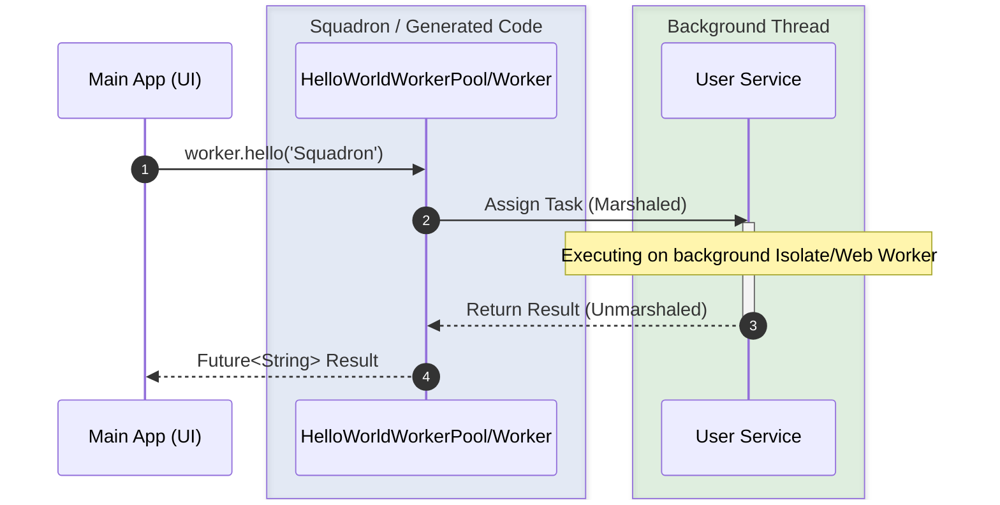

<table><tr>
<td valign="top">
  
</td>
<td>

## **Squadron - Multithreading and worker pools in Dart**

Offload CPU-bound and long running tasks and give your apps some air!  
Works everywhere: **Desktop**, **Server**, **Mobile**, and **Browser** (JS & WASM).

[Quick Start](#getting_started) • [Why Squadron?](#why-squadron) • [Wiki Documentation](https://github.com/d-markey/squadron/wiki) • [Samples](https://github.com/d-markey/squadron/tree/main/example)

[](https://pub.dev/packages/squadron)
[](https://pub.dev/packages/squadron)
[](https://pub.dev/packages/squadron)
[](https://github.com/d-markey/squadron/blob/master/LICENSE)
[](https://dart.dev/null-safety)
[](https://pub.dev/packages/lints)
[](https://pub.dev/packages/squadron/score)
[](https://pub.dev/packages/squadron/score)
[](https://pub.dev/packages/squadron/score)

[](https://github.com/d-markey/squadron/commits)
[](https://github.com/d-markey/squadron/actions/workflows/dart.yml)
[](https://github.com/d-markey/squadron/tree/main/coverage/html)
[](https://github.com/d-markey/squadron/tree/main/coverage/html)

</td>
</tr></table>

## 🚀 Why Squadron?

Dart is single-threaded by nature. While `Isolate.run()` is great for one-off tasks, it creates overhead for frequent operations. **Squadron** provides:

*   🔄 **Persistent Worker Pools**: Keep workers alive and ready to process tasks instantly.
*   🌐 **Seamless Web Support**: Uniform API for Isolates (Native) and Web Workers (JS/Wasm).
*   🛡️ **Type Safety**: Automatic code generation ensures your thread boundaries are type-safe.
*   🚫 **Cancellation**: Gracefully cancel long-running tasks.
*   📡 **Streaming**: Native support for `Stream` return types from workers.

---

## 🏗️ Architecture



---

## 📖 Table of Contents
- [Getting Started](#getting_started)
- [Implementing a Service](#implement)
- [Generating Workers](#build)
- [Running your Worker](#run)
- [Web Support (JS & Wasm)](#web)
- [Advanced Concepts](#advanced)
  - [Data Transfer & Marshaling](#marshaling)
  - [Exception Handling](#exceptions)
  - [Logging](#logging)
- [Community & Credits](#thanks)

---

## <a name="getting_started"></a>1. Getting Started

Add **[Squadron][pub_squadron]** to your dependencies and **[squadron_builder][pub_squadron_builder]** to your dev dependencies:

```yaml
dependencies:
  squadron: ^7.4.0

dev_dependencies:
  build_runner:
  squadron_builder: ^9.0.0
```

Run `dart pub get` to install.

## <a name="implement"></a>2. Implementing a Service

Create a class with the logic you want to run in the background. Use `@SquadronService` and `@SquadronMethod` annotations.

```dart
// file: hello_world.dart
import 'dart:async';
import 'package:squadron/squadron.dart';

import 'hello_world.activator.g.dart';
part 'hello_world.worker.g.dart';

@SquadronService(baseUrl: '~/workers', targetPlatform: TargetPlatform.all)
base class HelloWorld {
  @SquadronMethod()
  FutureOr<String> hello([String? name]) {
    name = name?.trim() ?? 'World';
    return 'Hello, $name!';
  }
}
```

## <a name="build"></a>3. Generating Workers

Squadron uses code generation to handle the boilerplate of thread communication. Run the following command:

```bash
dart run build_runner build
```

This creates `HelloWorldWorker` and `HelloWorldWorkerPool`. These classes implement the same interface as your service but proxy calls to background threads.

## <a name="run"></a>4. Running your Worker

In your application, instantiate the worker and use it like a normal service.

> [!IMPORTANT]  
> **Always stop your workers.** Failure to call `worker.stop()` will keep your program running indefinitely.

```dart
import 'hello_world.dart';

void main() async {
  final worker = HelloWorldWorker();
  try {
    // Squadron starts the worker automatically on the first call
    final message = await worker.hello('Squadron');
    print(message);
  } finally {
    worker.stop(); // Clean up the background thread
  }
}
```

---

## <a name="web"></a>🌍 Web Support (JS & Wasm)

Squadron is designed for a "write once, run anywhere" experience. When targeting the web, you must compile your worker entry points:

```bash
# Compile to JavaScript
dart compile js ".\src\lib\hello_world.web.g.dart" -o "..\web\workers\hello_world.web.g.dart.js"
# Compile to Web Assembly
dart compile wasm ".\src\lib\hello_world.web.g.dart" -o "..\web\workers\hello_world.web.g.dart.wasm"
```

Squadron will automatically detect the runtime environment and choose the correct implementation.

---

## <a name="advanced"></a>🛠️ Advanced Concepts

### <a name="marshaling"></a>Data Transfer & Marshaling
Because workers run in separate memory spaces, data must be serialized ("marshaled") to cross thread boundaries. While base types (Strings, Numbers, Lists, Maps) are handled automatically, custom objects require a `SquadronMarshaler`.

📖 **Learn more:** [Data Transfer and Types](https://github.com/d-markey/squadron/wiki/Data-Transfer-and-Types) & [Marshaling Wiki](https://github.com/d-markey/squadron/wiki/Marshaling)

### <a name="exceptions"></a>Exception Handling
Exceptions thrown in a worker are caught, serialized, and re-thrown on the caller's side, preserving the stack trace and error information where possible.

📖 **Learn more:** [Exception Management Wiki](https://github.com/d-markey/squadron/wiki/Exception-Management)

### <a name="logging"></a>Logging
Debugging background workers can be tricky. Squadron provides mechanisms to forward log messages from workers back to the main thread's debugger or console.

📖 **Learn more:** [Observability and Logging Wiki](https://github.com/d-markey/squadron/wiki/Observability-and-Logging)

---

## <a name="thanks"></a>Special Thanks

*   [Saad Ardati](https://github.com/SaadArdati) for feedback on Flutter integration.
*   [Martin Fink](https://github.com/martin-robert-fink) for major improvements to Stream support.
*   [Klemen Tusar](https://github.com/techouse) for the Chopper JSON decoder sample.
*   [James O'Leary](https://github.com/jpohhhh) for sponsorship and contributions.

---

[View the Full Wiki](https://github.com/d-markey/squadron/wiki) • [API Reference](https://pub.dev/documentation/squadron/latest/)

[pub_squadron]: https://pub.dev/packages/squadron
[pub_squadron_builder]: https://pub.dev/packages/squadron_builder
